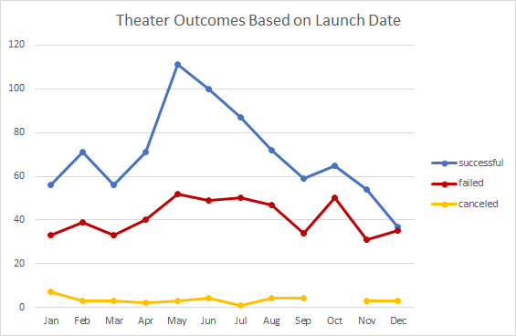
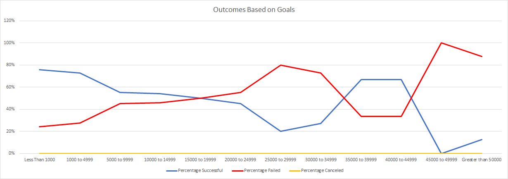

# Kickstarting with Excel

## Overview of Project
- Import data into a table for analysis.
- Apply filters, conditional formatting, and formulas.
- Generate and interpret pivot tables.
- Calculate summary statistics such as measures of central tendency, standard deviation, and variance.
- Characterize data to identify outliers in datasets.
- Perform an Excel analysis with visualizations.
- Interpret common Excel visualizations.

### Purpose
Analysis on Kickstarter data provided by Louise in order to identify different trends in relation to fundraising. The focus of this particular analysis is to know how different campaigns fared in relation to their launch dates and their funding goals. The previous analysis, determined that launch dates and goal amounts were heavy influences of successful outcomes. For this analysis, we will determine the number of successful, failed, or canceled outcomes viewed through the lens of the launch dates by month and the funding goal ranges.

## Analysis and Challenges
Due to the client's interest in the theater data, the data was filtered by that category. The number of live outcomes were nominal and were filtered from the data set.

### Analysis of Outcomes Based on Launch Date
Upon review, on a monthly basis, there are more successful outcomes than failed and canceled ones. No cancellations in October.

### Analysis of Outcomes Based on Goals
Due to the nominal number of live outcomes, the data was again filtered from the data set. The client's main interest is in the play’s subcategory, so an additional filter was applied. The goals were then binned into groups of $5000. The total number of successful, failed, and canceled outcomes were calculated for each bin and then converted into percentages.

### Challenges and Difficulties Encountered
The biggest challenge I came across was getting all the formulas to work correctly on the "Outcomes Based on Goals” tab. One needs to double check that the information meets the requirements and verify that the formulas are working correctly throughout the columns and rows. The slight mistake can drastically change the results and our analysis.  

## Results
- What are two conclusions you can draw about the Outcomes based on Launch Date?

  Upon review of the line graph, the key months to launch a successful theater are May and June, which declines through the end of the year. The worse months to start one are December and November. There are also very few canceled theater projects. Throughout the year, there are always more successful theater plays throughout the year than failed and canceled theater plays. 
 
- What can you conclude about the Outcomes based on Goals?

  From the graph, the most successful percentage is for goals that are less than 1000. The least successful goal ranges are the ones with 45000 and above.
 
- What are some limitations of this dataset?

  There is limited data available for this project, this said, we cannot confirm the accuracy of our conclusions mentioned above. The data provided is only a sample and does not represent an entire population.

- What are some other possible tables and/or graphs that we could create?

  The possibilities are endless when it comes to the graphs and tables we can create. It all would depend on what our focus and goals are for the analysis. For example, we could do a pie chart based on the percentage of each outcome, a table showing the average donation for each parent category or a table/graph displaying the average duration for each subcategory.
